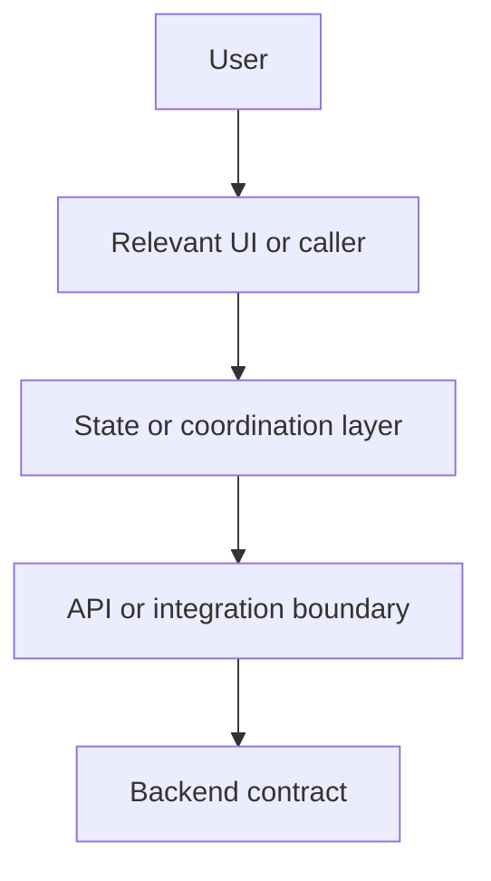
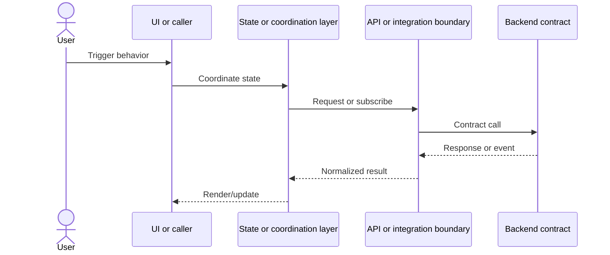
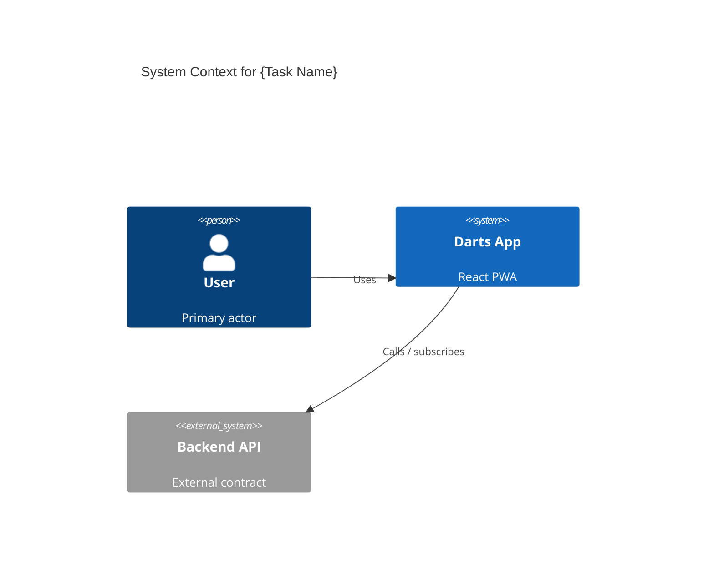
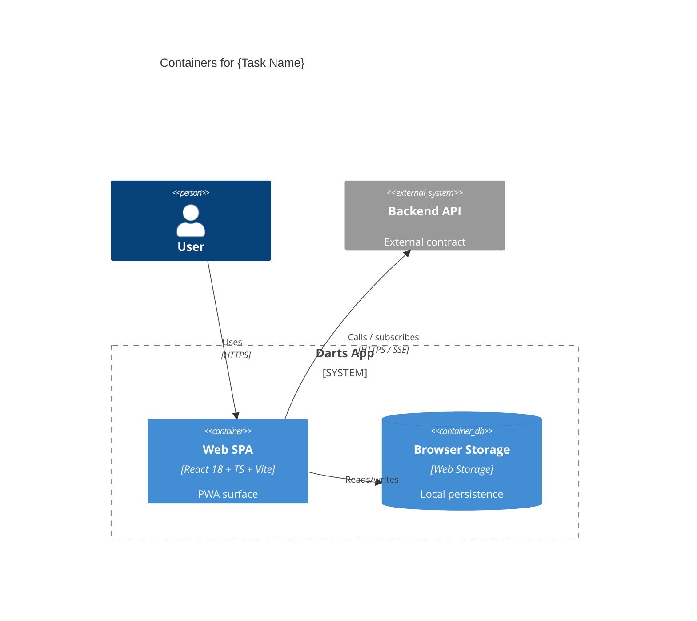
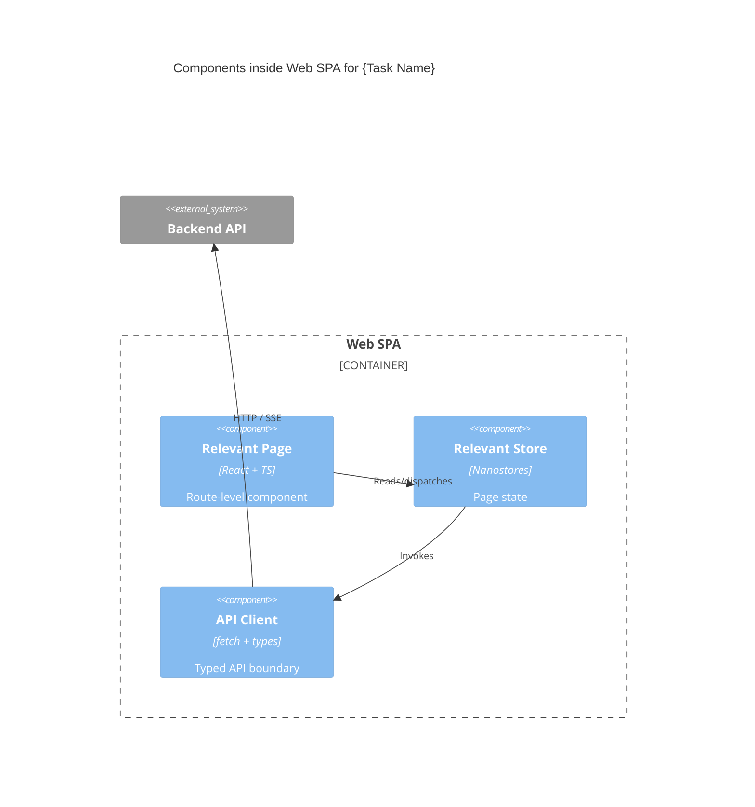

# Design Feature

Use this skill for phase 2 of the multi-agent workflow: Design, then Planning after explicit human approval.

This phase has two hard gates:

1. Create a diagram-first design artifact.
2. Stop and wait for Human-in-the-Loop approval before creating any planning files.

## Inputs

- `docs/{feature-slug}/research/research.md`
- The original user request or ticket.
- `docs/convention/coding-standards.md`
- Relevant `docs/convention/{domain}.md` files referenced by the research artifact.
- Current library docs through Context7 when library behavior is uncertain.

Do not reread the whole repository unless the research artifact is missing required evidence or contains a blocking unknown.

## Design Output Contract

Create exactly one design artifact before approval:

```text
docs/{feature-slug}/design/design.md
```

The design artifact must render visually in Typora when Markdown diagrams are enabled. The design itself is expressed only as diagrams; the only allowed prose is a short rationale block under each diagram that explains why the agent chose those nodes, boundaries, or participants based on `research.md`.

It uses two complementary views plus the C4 model for visualising software architecture (a top-down zoom from system context to containers to components):

- A Data Flow Diagram for the directional flow of data through the parts of the system that change for this task.
- A Sequence Diagram for the time-ordered runtime interactions of the primary user-visible scenario.
- The C4 model levels 1–3 (Context, Container, Component) for the structural view of the software architecture.

It may contain only:

- One title.
- One short source research link.
- `## Data Flow` with exactly one Mermaid `graph LR` or `graph TD` block, followed by `### Why` (the rationale).
- `## Sequence Diagram` with exactly one Mermaid `sequenceDiagram` block, followed by `### Why`.
- `## C4 Context` (Level 1) with exactly one Mermaid `C4Context` block, followed by `### Why`.
- `## C4 Container` (Level 2) with exactly one Mermaid `C4Container` block, followed by `### Why`.
- `## C4 Component` (Level 3) with exactly one Mermaid `C4Component` block, followed by `### Why`.

Each diagram must be represented only as:

- Data Flow Diagram with Mermaid `graph LR` or `graph TD`.
- Sequence Diagram with Mermaid `sequenceDiagram`.
- C4 Context Diagram with Mermaid `C4Context` (people, the Darts App boundary, external systems).
- C4 Container Diagram with Mermaid `C4Container` (deployable/executable units inside the system, e.g., the React PWA SPA, browser storage, backend API, SSE channel).
- C4 Component Diagram with Mermaid `C4Component` (the components inside the container most affected by the task — pages, stores, shared modules, API clients).

Do not include prose sections such as architecture narrative, alternatives, implementation plan, component plan, API rewrite proposal, testing strategy, or refactoring advice. Do not add tables, bullet lists, file inventories, risk sections, code snippets, or stage notes to `design.md`. The only prose allowed is the `### Why` rationale block under each diagram.

## Rationale (`### Why`) Rules

Each diagram must be followed by a `### Why` subsection that contains 2–5 short sentences (or up to 5 short bullets) explaining the design choice. The rationale must:

- Cite the specific facts from `research.md` (or the linked convention file) that justify the chosen nodes, boundaries, containers, components, or participants.
- Explain why elements were grouped, merged, or left out — for example, why a helper was hidden behind its owning module, or why a system was treated as external.
- For C4 levels, explain why the chosen container or component zoom is the smallest one that still covers the task.
- Stay neutral about implementation: do not propose new APIs, new files, refactors, alternatives, or testing strategy.
- Reference research evidence using the same `path:line` style used in `research.md` whenever a concrete file or symbol is named.

Keep each rationale block short and decision-focused. If there is nothing non-obvious to justify, write one sentence stating that the structure mirrors the existing boundaries from `research.md` and naming them.

## design.md Template

````markdown
# Design: {Task Name}

Source research: `docs/{feature-slug}/research/research.md`

## Data Flow



### Why

- Nodes mirror the boundaries already present in `research.md` for this task.
- {1–4 short sentences explaining why these flows and groupings, citing `path:line` evidence.}

## Sequence Diagram



### Why

- {Why these participants were chosen for the primary scenario, and which local helpers were hidden behind their owning module and why.}

## C4 Context



### Why

- {Which actors and external systems matter for this task and why; which were intentionally left out because the task does not change their contract.}

## C4 Container



### Why

- {Why these containers are the deployable/executable units involved in the task; why irrelevant containers were omitted.}

## C4 Component



### Why

- {Why these components are the smallest set that covers the task; cite their files via `path:line` from `research.md`.}
````

Adjust participants and components to the actual research facts. Remove placeholder nodes that are not part of the task. Keep diagrams readable: show only primary boundaries, state transitions, external contracts, and user-visible branches. Do not mirror every file, test, helper, or evidence item from `research.md`.

Typora compatibility rules:

- Use fenced Markdown code blocks with `mermaid` as the language.
- Use `graph LR` or `graph TD` for the Data Flow Diagram, matching Typora's Mermaid flowchart examples.
- Use `sequenceDiagram` for the Sequence Diagram.
- Use `C4Context`, `C4Container`, `C4Component` for the C4 model levels.
- Do not use ASCII diagrams, tables, screenshots, or prose descriptions as substitutes for diagrams.

## Mermaid Syntax Safety Rules

The Mermaid parser treats several characters as shape openers or delimiters, which causes lexical errors on otherwise valid-looking labels. To avoid `Lexical error on line N. Unrecognized text.` failures in `graph`/`flowchart` blocks:

- Always wrap node labels in double quotes when they contain any of: `/`, `\`, `(`, `)`, `:`, `,`, `;`, `#`, `&`, `?`, `=`, `<`, `>`, `|`, `{`, `}`, `[`, `]`, `"`, backticks, or whitespace-sensitive content.
  - Wrong: `Route[/playerprofile route]` — Mermaid reads `[/...` as the parallelogram shape opener and fails.
  - Right: `Route["/playerprofile route"]`.
- For literal route paths, file paths, query strings, and URL-like text, default to the quoted form even when it would technically parse, so the design stays robust under future label edits.
- Inside a quoted label, escape an embedded `"` as `#quot;` (Mermaid's HTML-entity escape). Do not use backslash escaping.
- Use only ASCII identifiers (letters, digits, underscore) on the left of `[`, `(`, `{`, etc. Put any special characters inside the quoted label, never in the node id.
- Keep edge labels in the quoted form too: `A -- "calls /api/foo" --> B`, not `A -- calls /api/foo --> B`.
- For `sequenceDiagram`, quote participant aliases that contain spaces or punctuation: `participant API as "Backend API (SSE)"`.
- For the C4 levels (`C4Context`, `C4Container`, `C4Component`), keep description and technology strings as plain double-quoted strings, e.g. `Container(spa, "Web SPA", "React 18 + TypeScript + Vite", "PWA surface")`. Do not put unescaped quotes or angle brackets inside those strings.

When a Mermaid block fails to render, treat it as a blocking issue for the design artifact and fix the offending label using the quoting rules above before re-saving `design.md`.

## C4 Layout Safety Rules

Mermaid's C4 renderer is experimental and overlaps its own labels when shapes per row, label length, or boundary nesting are too aggressive. To keep `C4Context`, `C4Container`, and `C4Component` readable in Typora preview:

- Always include `UpdateLayoutConfig($c4ShapeInRow="3", $c4BoundaryInRow="1")` immediately after `title` in every C4 block. This forces a compact, predictable wrap. Reduce `$c4ShapeInRow` to `"2"` if a diagram still overlaps; do not increase past `"4"`.
- Keep the `label` argument short (under ~24 characters). Move long names of routes, file paths, or symbols into the `description` argument or the rationale block.
- Keep the `technology` argument to a stack tag, not a file path. Examples: `"React 18 + TS"`, `"Nanostores"`, `"REST + SSE"`. Do not put `src/...` paths or wildcard globs in `technology`; that field renders inside the box and stretches it wide.
- Keep the `description` argument to one short clause (under ~60 characters). If you need to point to a specific file, name it in the `### Why` rationale with `path:line` instead.
- Cap each `Container_Boundary` at six components. If the task naturally requires more, hide local helpers behind their owning module rather than splitting the diagram, so the contract of "exactly one `C4Component` block" still holds.
- Avoid stacking `System_Boundary` inside `System_Boundary`. Use a single boundary per diagram and keep external systems outside it.
- Keep `Rel(...)` labels short ("Calls", "Reads/writes", "GET /login/success"). Long edge labels overlap nodes during layout.
- For multi-line wrapping inside a label (rare, only when truly necessary), use the literal string `\n` inside double quotes; do not insert real newlines.

## Design Rules

- Base every node, container, component, and interaction on facts from `research.md`.
- Prefer existing boundaries and names from the codebase.
- Keep each diagram minimal; include only elements needed for the task.
- Prefer 6–12 nodes in the Data Flow diagram unless the approved research proves a larger boundary is unavoidable.
- Prefer fewer than 12 participants in the Sequence Diagram; combine local helpers behind their owning module when that improves readability.
- Keep the C4 Context diagram at system-context level: people, the Darts App boundary, and external systems only.
- Keep the C4 Container diagram at the deployable/executable-unit level inside the Darts App boundary; do not push into individual modules or files.
- Keep the C4 Component diagram zoomed into the single container most affected by the task; do not mix components from multiple containers in one diagram.
- Show external systems and browser APIs explicitly when they matter.
- Mark uncertain edges as `Unknown` only if research already marked them as unknown.
- Do not invent missing components, APIs, stores, or routes.
- Do not write production code.
- Do not create planning files before approval.
- Every diagram must be paired with its `### Why` block; an unexplained diagram is incomplete.

## Human-In-The-Loop Gate

After writing `design.md`, stop and ask for approval with this exact message shape:

```text
Design written to docs/{feature-slug}/design/design.md.
Please review and approve before I create planning files.
```

Continue only after explicit approval from the human, such as `approve`, `approved`, `yes`, `go`, or another unambiguous approval.

If the human requests changes, update only `design.md`, then stop at the approval gate again.

## Planning After Approval

After explicit approval, create planning files under:

```text
docs/{feature-slug}/plan/
```

The required planning file is:

```text
docs/{feature-slug}/plan/plan.md
```

For large or risky work, also create focused stage files:

```text
docs/{feature-slug}/plan/stage-{number}-{short-name}.md
```

Split planning into multiple stages when a single implementation step would require broad reasoning, many files, uncertain contracts, or mixed concerns. The split exists to reduce hallucination risk and make each implementation pass small enough to verify.

## plan.md Requirements

`plan.md` must contain:

- Inputs: links to research and approved design.
- Stages: numbered stages with small objectives.
- Exact file scope for each stage.
- Allowed changes for each stage.
- Required tests for each behavior change.
- Verification commands for each stage.
- Rollback notes.
- Human approval boundary before implementation starts.

Do not write production code in this phase.

## Stage Rules

Each stage must be:

- Small and reviewable.
- Grounded in the approved diagrams.
- Limited to an exact file scope.
- Independently testable when possible.
- Free of hidden assumptions.
- Clear about what must not be changed.

Never plan "implement the whole feature" as one broad stage when the work can be split.

## Done Criteria

- `docs/{feature-slug}/design/design.md` exists and contains, in this order, the Data Flow, Sequence, C4 Context, C4 Container, and C4 Component diagrams, each followed by a `### Why` rationale block.
- The agent stopped for HITL approval after writing `design.md`.
- Planning files were created only after explicit approval.
- `docs/{feature-slug}/plan/plan.md` exists after approval.
- Large or risky work is split into multiple small planning stages.
- No production code was changed.
