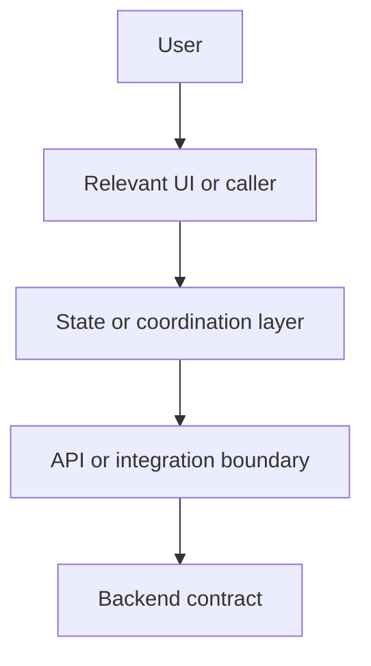
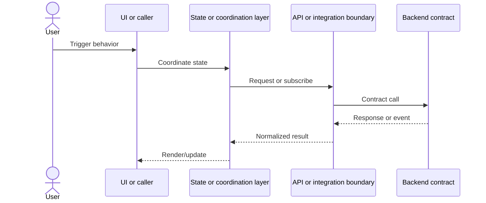

# Design Feature

Use this skill for phase 2 of the multi-agent workflow: Design, then Planning after explicit human approval.

This phase has two hard gates:

1. Create a diagram-only design artifact.
2. Stop and wait for Human-in-the-Loop approval before creating any planning files.

## Inputs

- `docs/{feature-slug}/research/research.md`
- The original user request or ticket.
- `docs/convention/coding-standards.md`
- Relevant `docs/convention/{domain}.md` files referenced by the research artifact.
- Current library docs through Context7 when library behavior is uncertain.

Do not reread the whole repository unless the research artifact is missing required evidence or contains a blocking unknown.

## Design Output Contract

Create exactly one design artifact before approval:

```text
docs/{feature-slug}/design/design.md
```

The design artifact must be diagram-only and render visually in Typora when Markdown diagrams are enabled. It may contain only:

- One title.
- One short source research link.
- `## Data Flow` with exactly one Typora-compatible Mermaid flowchart block.
- `## Sequence Diagram` with exactly one Mermaid `sequenceDiagram`.

The design itself must be represented only as:

- Data Flow Diagram with Mermaid `graph LR` or `graph TD`.
- Sequence Diagram with Mermaid `sequenceDiagram`.

Do not include prose sections such as architecture narrative, alternatives, implementation plan, component plan, API rewrite proposal, testing strategy, or refactoring advice. Do not add tables, bullet lists, file inventories, risk sections, code snippets, or stage notes to `design.md`.

## design.md Template

````markdown
# Design: {Task Name}

Source research: `docs/{feature-slug}/research/research.md`

## Data Flow



## Sequence Diagram


````

Adjust participants to the actual research facts. Remove placeholder nodes that are not part of the task. Keep both diagrams readable: show only primary boundaries, state transitions, external contracts, and user-visible branches. Do not mirror every file, test, helper, or evidence item from `research.md`.

Typora compatibility rules:

- Use fenced Markdown code blocks with `mermaid` as the language.
- Use `graph LR` or `graph TD` for Data Flow, matching Typora's Mermaid flowchart examples.
- Use `sequenceDiagram` for Sequence Diagram.
- Do not use ASCII diagrams, tables, screenshots, or prose descriptions as substitutes for diagrams.

## Design Rules

- Base every node and interaction on facts from `research.md`.
- Prefer existing boundaries and names from the codebase.
- Keep the diagram minimal; include only elements needed for the task.
- Prefer 6-12 nodes in the Data Flow diagram unless the approved research proves a larger boundary is unavoidable.
- Prefer fewer than 12 participants in the Sequence Diagram; combine local helpers behind their owning module when that improves readability.
- Show external systems and browser APIs explicitly when they matter.
- Mark uncertain edges as `Unknown` only if research already marked them as unknown.
- Do not invent missing components, APIs, stores, or routes.
- Do not write production code.
- Do not create planning files before approval.

## Human-In-The-Loop Gate

After writing `design.md`, stop and ask for approval with this exact message shape:

```text
Design written to docs/{feature-slug}/design/design.md.
Please review and approve before I create planning files.
```

Continue only after explicit approval from the human, such as `approve`, `approved`, `yes`, `go`, or another unambiguous approval.

If the human requests changes, update only `design.md`, then stop at the approval gate again.

## Planning After Approval

After explicit approval, create planning files under:

```text
docs/{feature-slug}/plan/
```

The required planning file is:

```text
docs/{feature-slug}/plan/plan.md
```

For large or risky work, also create focused stage files:

```text
docs/{feature-slug}/plan/stage-{number}-{short-name}.md
```

Split planning into multiple stages when a single implementation step would require broad reasoning, many files, uncertain contracts, or mixed concerns. The split exists to reduce hallucination risk and make each implementation pass small enough to verify.

## plan.md Requirements

`plan.md` must contain:

- Inputs: links to research and approved design.
- Stages: numbered stages with small objectives.
- Exact file scope for each stage.
- Allowed changes for each stage.
- Required tests for each behavior change.
- Verification commands for each stage.
- Rollback notes.
- Human approval boundary before implementation starts.

Do not write production code in this phase.

## Stage Rules

Each stage must be:

- Small and reviewable.
- Grounded in the approved diagrams.
- Limited to an exact file scope.
- Independently testable when possible.
- Free of hidden assumptions.
- Clear about what must not be changed.

Never plan "implement the whole feature" as one broad stage when the work can be split.

## Done Criteria

- `docs/{feature-slug}/design/design.md` exists and contains only Data Flow and Sequence Diagram as the design.
- The agent stopped for HITL approval after writing `design.md`.
- Planning files were created only after explicit approval.
- `docs/{feature-slug}/plan/plan.md` exists after approval.
- Large or risky work is split into multiple small planning stages.
- No production code was changed.
