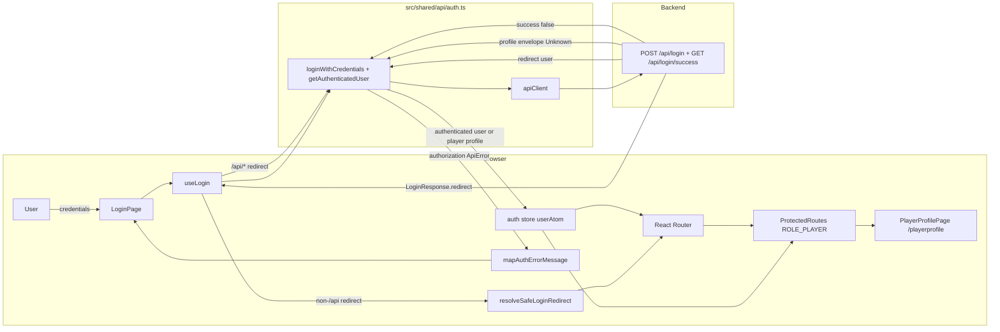
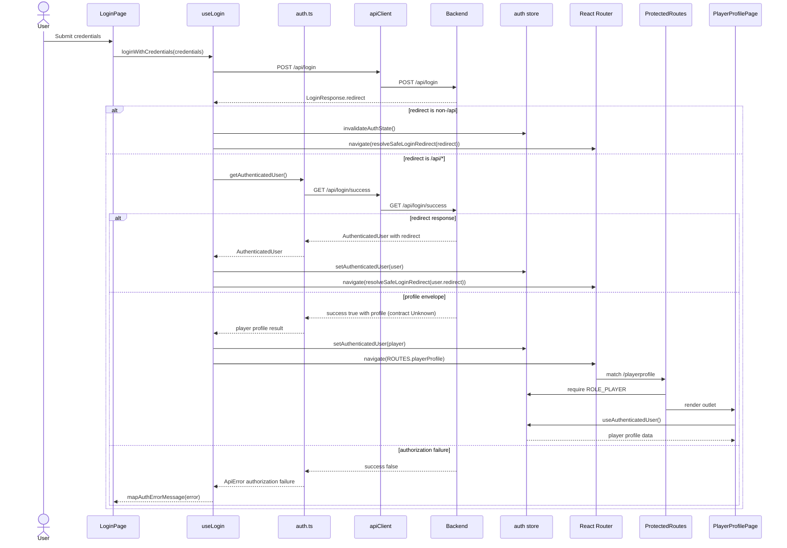

# Design: Player Profile Login Success

Source research: `docs/player-profile-login-success/research/research.md`

## Data Flow

```mermaid
graph LR
  subgraph Browser
    User[User]
    LoginPage[LoginPage]
    UseLogin[useLogin]
    SafeRedirect[resolveSafeLoginRedirect]
    Router[React Router]
    Guard[ProtectedRoutes ROLE_PLAYER]
    ProfilePage[PlayerProfilePage /playerprofile]
    AuthStore[auth store userAtom]
    ErrorMapper[mapAuthErrorMessage]
  end

  subgraph FrontendAPI[src/shared/api/auth.ts]
    AuthAPI[loginWithCredentials + getAuthenticatedUser]
    ApiClient[apiClient]
  end

  subgraph Backend
    AuthEndpoints[POST /api/login + GET /api/login/success]
  end

  User -->|credentials| LoginPage
  LoginPage --> UseLogin
  UseLogin --> AuthAPI
  AuthAPI --> ApiClient
  ApiClient --> AuthEndpoints
  AuthEndpoints -->|LoginResponse.redirect| UseLogin

  UseLogin -->|non-/api redirect| SafeRedirect
  SafeRedirect --> Router

  UseLogin -->|/api/* redirect| AuthAPI
  AuthEndpoints -->|redirect user| AuthAPI
  AuthEndpoints -->|profile envelope Unknown| AuthAPI
  AuthEndpoints -->|success false| AuthAPI

  AuthAPI -->|authenticated user or player profile| AuthStore
  AuthStore --> Guard
  Guard --> ProfilePage
  AuthAPI -->|authorization ApiError| ErrorMapper
  ErrorMapper --> LoginPage
  AuthStore --> Router
  Router --> Guard
```

## Sequence Diagram

```mermaid
sequenceDiagram
  actor User
  participant LoginPage
  participant Login as useLogin
  participant AuthAPI as auth.ts
  participant ApiClient as apiClient
  participant Backend as Backend
  participant AuthStore as auth store
  participant Router as React Router
  participant ProtectedRoutes
  participant ProfilePage as PlayerProfilePage

  User->>LoginPage: Submit credentials
  LoginPage->>Login: loginWithCredentials(credentials)
  Login->>ApiClient: POST /api/login
  ApiClient->>Backend: POST /api/login
  Backend-->>Login: LoginResponse.redirect

  alt redirect is non-/api
    Login->>AuthStore: invalidateAuthState()
    Login->>Router: navigate(resolveSafeLoginRedirect(redirect))
  else redirect is /api/*
    Login->>AuthAPI: getAuthenticatedUser()
    AuthAPI->>ApiClient: GET /api/login/success
    ApiClient->>Backend: GET /api/login/success

    alt redirect response
      Backend-->>AuthAPI: AuthenticatedUser with redirect
      AuthAPI-->>Login: AuthenticatedUser
      Login->>AuthStore: setAuthenticatedUser(user)
      Login->>Router: navigate(resolveSafeLoginRedirect(user.redirect))
    else profile envelope
      Backend-->>AuthAPI: success true with profile (contract Unknown)
      AuthAPI-->>Login: player profile result
      Login->>AuthStore: setAuthenticatedUser(player)
      Login->>Router: navigate(ROUTES.playerProfile)
      Router->>ProtectedRoutes: match /playerprofile
      ProtectedRoutes->>AuthStore: require ROLE_PLAYER
      ProtectedRoutes->>ProfilePage: render outlet
      ProfilePage->>AuthStore: useAuthenticatedUser()
      AuthStore-->>ProfilePage: player profile data
    else authorization failure
      Backend-->>AuthAPI: success false
      AuthAPI-->>Login: ApiError authorization failure
      Login-->>LoginPage: mapAuthErrorMessage(error)
    end
  end
```
