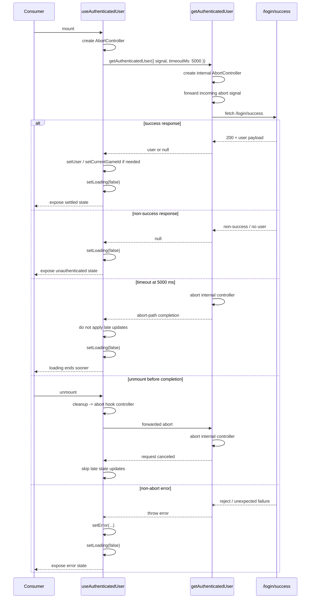

# Sequence: Auth Check with Single Timeout Source

## Notes

- This sequence intentionally preserves the hook’s unmount cleanup while removing the separate hook-local timeout timer. [F2][F4][F5]
- `ProtectedRoutes` and `LoginPage` are the main user-visible consumers of the loading-state change. [F7][F9]
